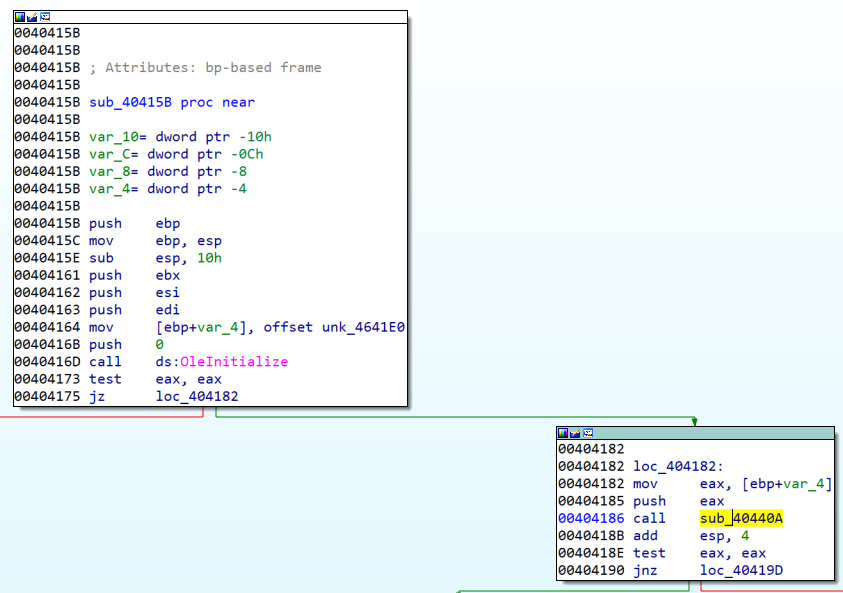
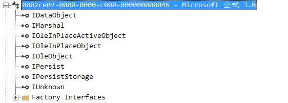
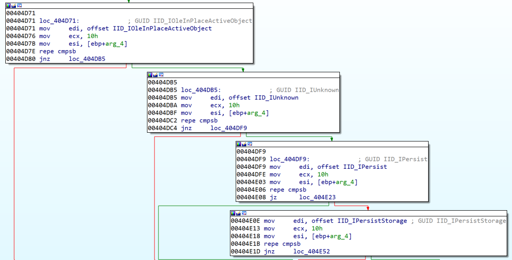
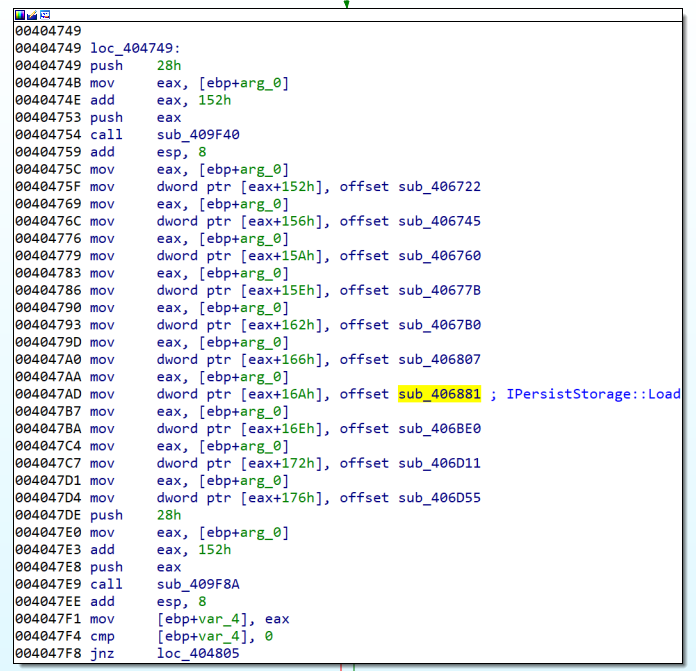
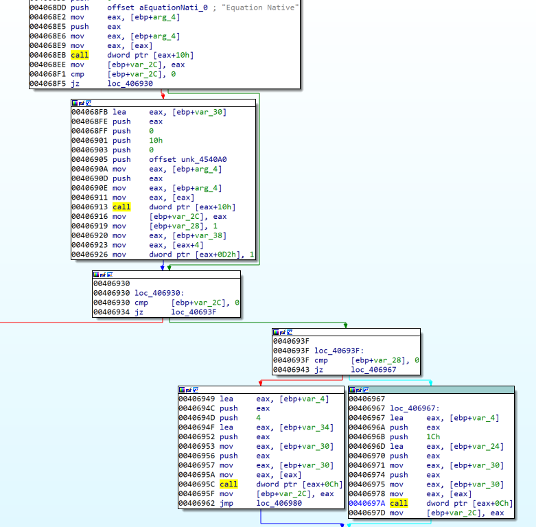
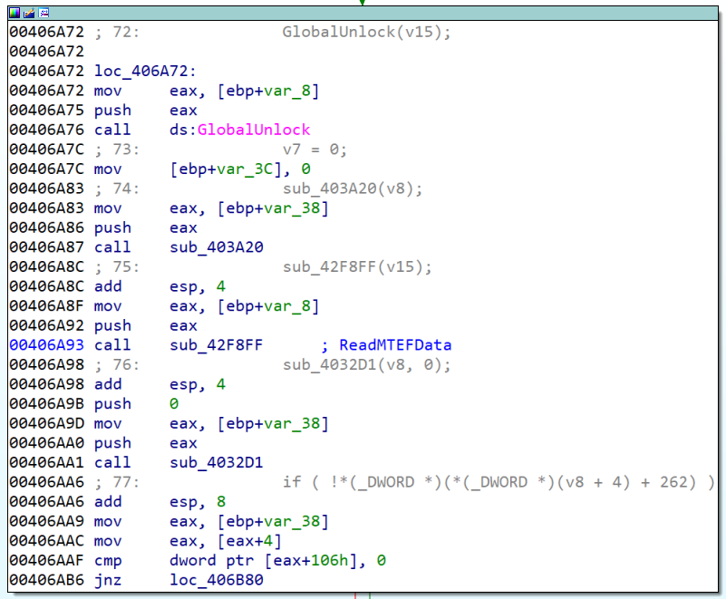
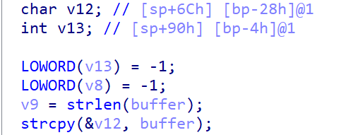
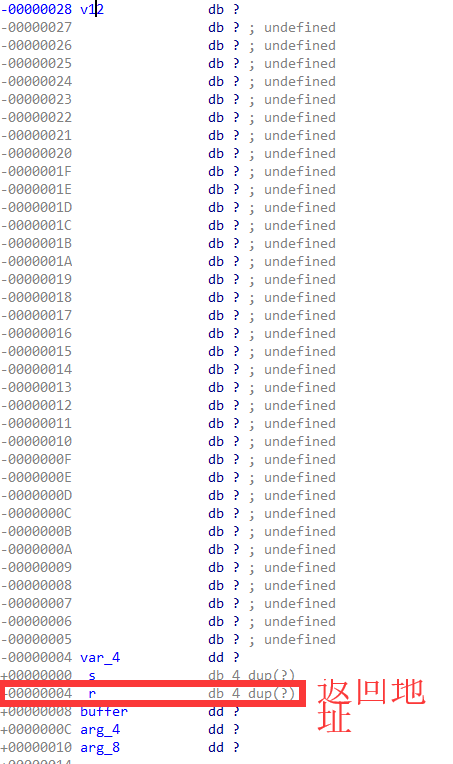
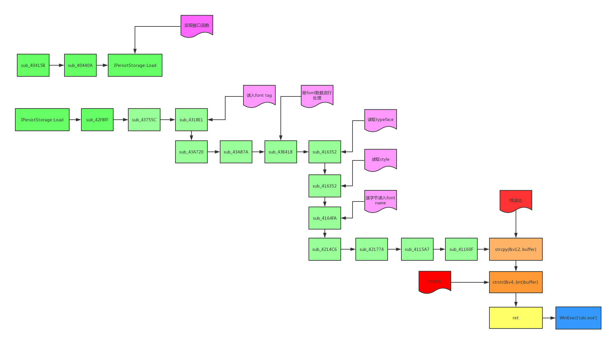

# 漏洞原理分析

调试环境:  windows7_sp1_x86 + office 2007 x86 + windbg 6.12 x86

EQNEDT32.EXE version:  2000.11.9.0

该漏洞位于实现OLE接口的IPersistStorage::Load函数中。sub_40415B为ole的初始化过程，如下图1所示，它调用了sub_40440A函数，sub_40440A的主要作用是在初始化EQNEDT32.EXE实现的COM接口的各个函数指针。

（图一）

通过工具我们可以看到EQNEDT32.EXE实现了如下接口(图2)：（工具为OleViewDotNet)

(图二）

我们可以在EQNEDT32.EXE文件里面看到对这些接口的比较和使用，如图3所示：

(图三）

我们重点关注IPersistStorage接口，任何ole对象必须实现该接口，图4为微软对该接口的说明：

(图四）

我们可以看到IPersistStorage接口的各个方法指针在 sub_40440A中被初始化，如图5所示：

(图五）

图5中圈出的IPersistStorage::Load方法的主要用途是用来读入ole数据，在EQNEDT32.EXE中实现该方法后，即可被调用以读入MathType对应的ole数据，我们来看一下这个Load函数内部是怎么实现的，我们可以看到该函数的核心逻辑是打开并读入一个叫做“Equation Native”的流的数据(图6-1)，在此基础上进一步读入MathType数据(图6-2):

(图6.1）

(图6.2）

我们来看一下这个“Equation Native”流来自哪里(图7)，通过分析ole文件，我们可以看到该流的数据由用户所提供，正常情况下，流里面的数据代表一个MathType的公式，而恶意攻击者构造的数据可以如图7所示：

(图7）

漏洞的直接触发原因为：在读入公式的Font Name数据时，在将Name拷贝到一个函数内局部变量的时候没有对Name的长度做校验，从而造成栈缓冲区溢出，如图8所示。从图9可以看出，函数给v12变量分配的大小是0x24个字节，超过该大小就会造成溢出，从而覆盖不远处的eip，达到劫持程序执行流的目的，从v12开始算起，eip的位置为+0x2c，即44，再往前覆盖就是调用参数。

(图8）

(图9）

整个漏洞执行过程的步骤如图10所示

(图10）

在构造exp寻找偏移时，在strstr函数中发生了一次不可利用的crash.原因是strstr函数中引用我们控制的内容所指向的内存(如下代码片段)。所以需要在构造时设置'\x00'截断

      v2 = *(_BYTE *)buffer;

# 从零开始构造exp

完全按照[银雁冰](https://www.anquanke.com/post/id/87311)大牛的文章进行.最终弹出了calc.exe

